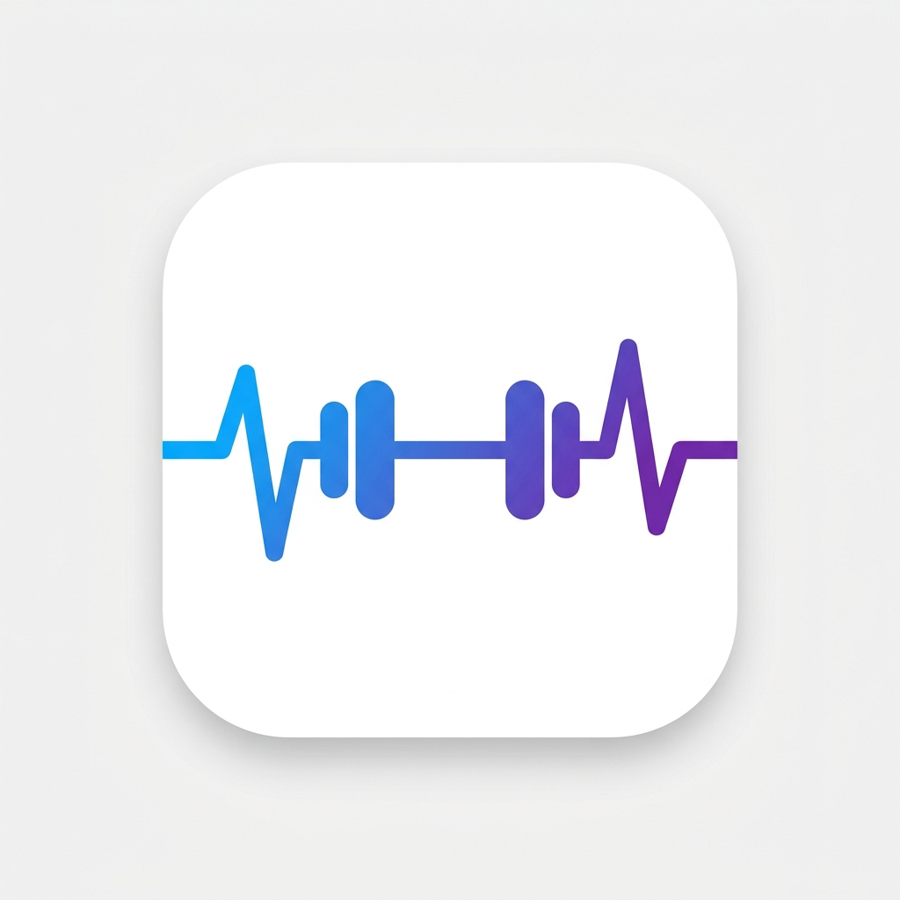

<div align="center">
  

  # 🏋️‍♂️ FitKoç (FitCoach)
  **Yapay Zeka Destekli Kişisel Antrenör ve Beslenme Asistanı**

  [](#)
  [](#)
  [](#)
</div>

<br/>

FitKoç, sadece sıradan bir kalori takip uygulaması değil, aynı zamanda yapay zeka tarafından desteklenen **kapsamlı bir sağlık ve oyunlaştırma (gamification)** platformudur. Kullanıcıların beslenme ve antrenman süreçlerini eğlenceli, motive edici ve akıllı bir hale getirmeyi amaçlar.

---

## ✨ Öne Çıkan Özellikler

### 📸 Yapay Zeka Öğün Tarayıcı (AI Food Scanner)
Yediğiniz yemeğin sadece fotoğrafını çekin. Yapay zeka yemeğinizi analiz eder, içindeki malzemeleri tanımlar ve porsiyon bazlı **Kalori, Protein, Karbonhidrat ve Yağ** hesaplamasını saniyeler içinde yaparak günlüğünüze ekler.

### 🗺️ Kas Gelişim Haritası (Hero Muscle Map)
Antrenman yaptıkça hangi kas grubunuzu ne kadar çalıştırdığınızı renk kodlarıyla (Seviye 1'den Seviye 5'e kadar kızaran) dinamik bir vücut haritası üzerinden takip edebilirsiniz.

### 🔥 Seri (Streak) ve Rozet Sistemi
Günlük kalori hedefinize ulaştığınız her gün "Streak" (Seri) sayınız artar. 3 Günlük Seri, 100. Antrenman gibi dönüm noktalarında özel tasarım rozetlerin (Badges) kilidini açarak motivasyonunuzu yüksek tutarsınız.

### 🤖 Akıllı Koç (AI Chat)
Antrenman, beslenme veya sakatlık önleme konusunda aklınıza takılan her soruyu sorabileceğiniz kişisel AI koçunuz 7/24 cebinizde.

### 📊 Detaylı Analitikler ve Raporlar
- Haftalık ve Aylık kalori/makro çizelgeleri
- 1RM (1 Tekrar Maksimum) güç gelişimi takibi
- Kilo değişim grafikleri ve geçmiş takvimi

---

## 🚀 Kurulum ve Çalıştırma (Geliştiriciler İçin)

Projeyi kendi bilgisayarınızda çalıştırmak için aşağıdaki adımları izleyin:

```bash
# 1. Repoyu klonlayın
git clone https://github.com/berkayztrk2/Fitkoc.git

# 2. Proje dizinine girin
cd Fitkoc

# 3. Bağımlılıkları yükleyin
npm install

# 4. (Opsiyonel) AI özellikleri için Gemini API anahtarını tanımlayın
#    .env.example dosyasını .env olarak kopyalayıp anahtarınızı girin
cp .env.example .env

# 5. Uygulamayı başlatın (Expo)
npx expo start
```
*Not: İOS emülatörü için terminalde (Mac'te) `npx expo run:ios`, Android emülatörü için `npx expo run:android` kullanabilirsiniz.*

### 🔑 AI Özellikleri (API Anahtarı)
Öğün fotoğrafı analizi, AI koç sohbeti ve tarif oluşturucu **Google Gemini API** kullanır. İki yoldan anahtar tanımlayabilirsiniz:
1. **Uygulama içinden:** Profil → Ayarlar → **Gemini API Anahtarı** (cihazda saklanır, en kolayı).
2. **Build zamanında:** Proje kökünde `.env` dosyasına `EXPO_PUBLIC_GEMINI_API_KEY=...` ekleyin.

Ücretsiz anahtarı [Google AI Studio](https://aistudio.google.com/app/apikey) üzerinden alabilirsiniz.

---

## 🛠️ Kullanılan Teknolojiler
- **Framework:** React Native & Expo Router
- **State Yönetimi:** React Context API & AsyncStorage (Yerel Hafıza)
- **Yapay Zeka:** Google Gemini API (`gemini-2.5-flash` — görsel ve metin işleme)
- **İkonlar:** Lucide React Native
- **Grafikler:** React Native SVG / Expo uyumlu grafik kütüphaneleri

<div align="center">
  <p>Made with ❤️ by Berkay</p>
</div>
